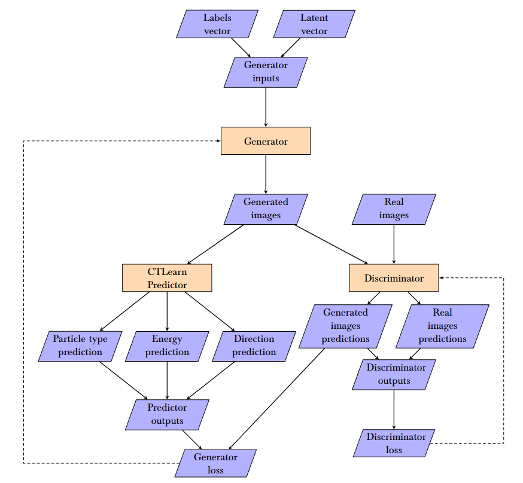
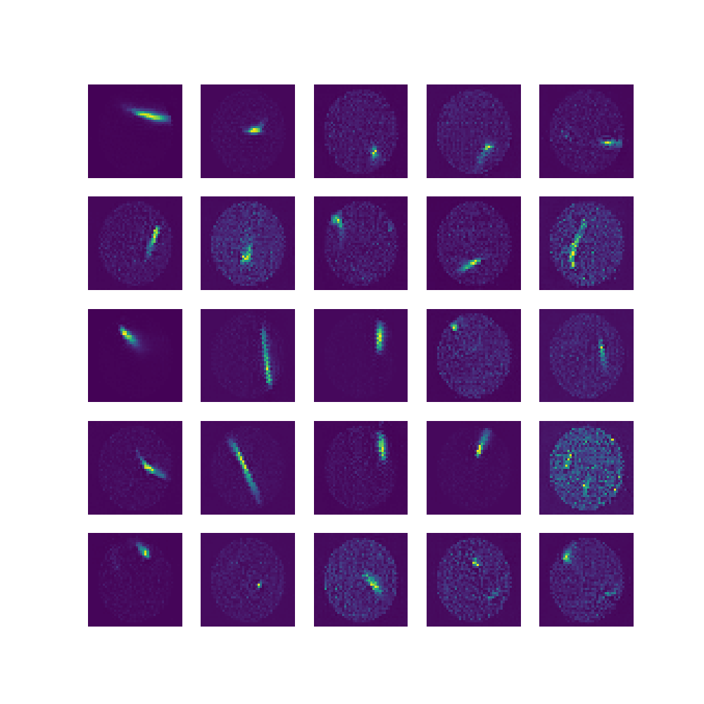
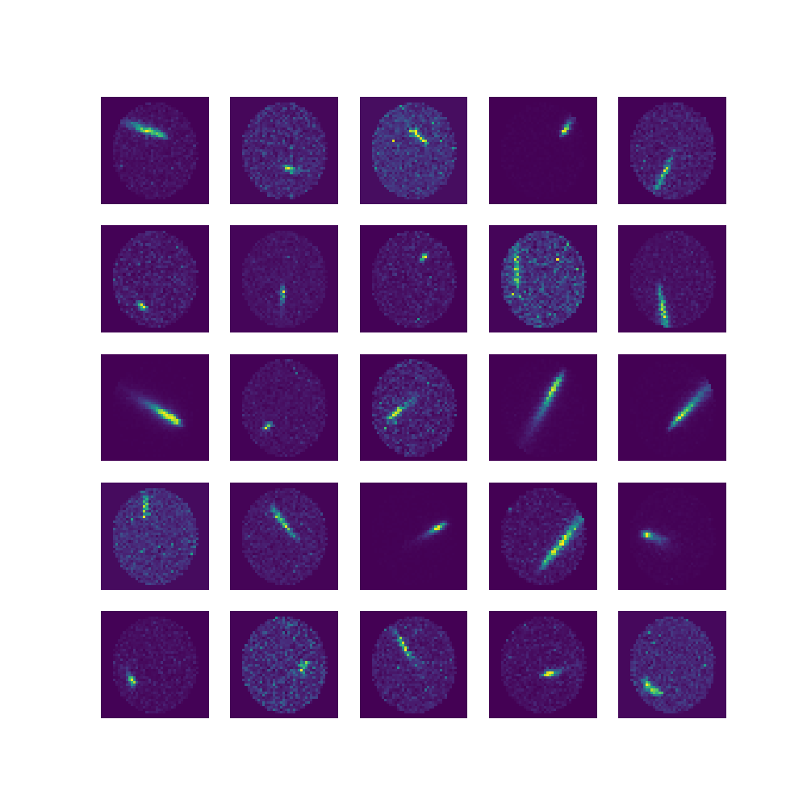

# CTGANs

## Set up

First, CTLearn installation is required:

1. `git clone https://github.com/ctlearn-project/ctlearn`
2. `cd ctlearn`
3. `git checkout tf_update`
4. `conda env create -f environment-gpu.yml`
5. `conda activate ctlearn_tf2`
6. `pip install .`

Additionally, the following installation is necessary:

7. `pip install tensorflow-addons`
8. `pip install --upgrade matplotlib`

To plot model graphs:

8. `conda install pydot`

## Usage

First, update `GANs.yml` (and `predictor.yml` if no predefined model is used as a predictor). By the moment, only images with shape (43, 43, channels) are supported and possible labels are 'particletype', 'energy' and 'direction'. To train the models, simply run `main.py`.

## The model

## Results

Generated images after 87 epochs of training with a dataset of over 1.400.000 images:

The real images corresponding to same labels are:

